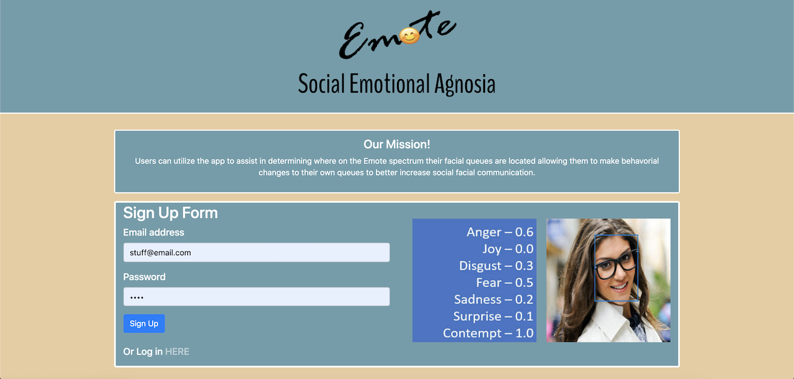
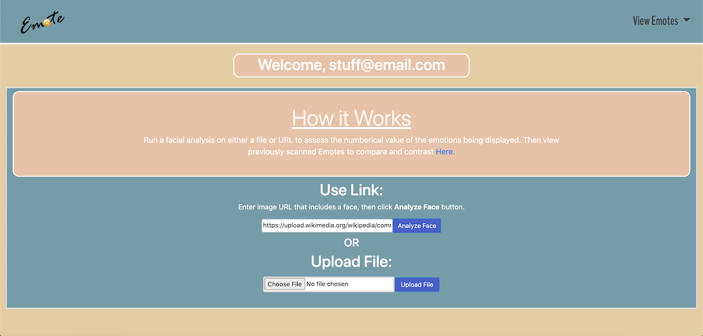
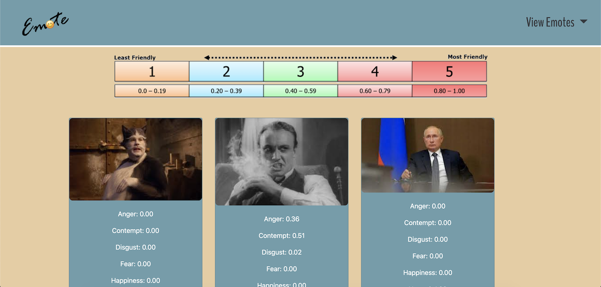

# Grocery Guys

Link to deployed site: [Grocery Guys](https://intense-chamber-80785.herokuapp.com)

## Description
An application geared towards assisting the Autism Community that allows the user to view uploaded images and have them analyzed to return numerical data identifying the socially-perceived emotions found within the image. The user can also view previously anazlyed images to use as a reference for future use.

## How it works
    1. The user can sign up or log in using authenticated emails and passwords
    2. The user is brought to a page where they can upload/analyze images by URL or file
    3. The image is returned as well as numerical data representing the emotions found in the image
    4. The user can view previously analyzed images to use for future reference

### Images of application

## Credits/Technologies
    1. HTML
    2. CSS
    3. JavaScript/jQuery
    4. MVC Design
    5. Node.js
    6. Express.js
    7. MySql/JAWS Database
    8. Handlebars.js
    9. Passport.js
    10. Memorystore
    11. Multer Storage Imgur
    12. Imgur API
    13. Microsoft Face API + Azure Rest